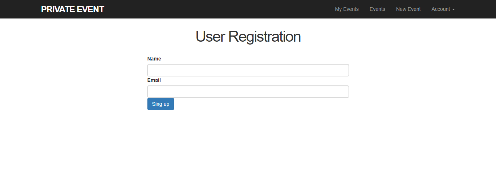

# Rails projects authentication
>This is a project was built to demonstrate how to implementing authentication using Ruby on rails

# Things you may want to cover:

1. Model Associations
2. Authentication
3. Routes
4. Models

# TECHNICAL DOCUMENTATION
## Pre-requisites
* Ruby version
You will need Ruby Version 2.6.5

* System dependencies
Windows/ Mac
Rails 6.0.1

## Installation and running
Clone project and run
`bundle install --without production`
`yarn install`

 Start the rails server
`rails serve`

## How to contribute and partipate
Fork this repo and submit a PR for review and potential merge to main branch

## Engineers

👨‍💻 **Christian Salazar**

- Github: [@grifo89](https://github.com/grifo89)
- Twitter: [Christian_sm91](https://twitter.com/Christian_sm91)
- LinkedIn: [Christian Salazar](https://www.linkedin.com/in/christian-salazar-mi%C3%B1o/)

‍‍💻 **Edem Agbenyo**
- Github: [Edem Agbenyo](https://github.com/edemagbenyo/)
